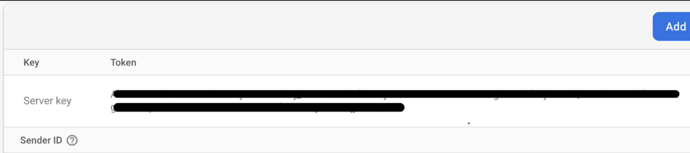

# Set up

First, make sure you have a working installation of Node.js and NPM.

Now clone the repository and install dependencies:

```
git clone https://github.com/acmutd/hackportal
cd hackportal
npm install
```
Next, set up the environment variables.


# Setting up Firebase

By default, this project uses Firebase APIs. If you use any of
the following, you must set up Firebase APIs before running this app:

- Firebase Authentication
- Cloud Firestore
- Google Cloud Storage for Firebase

To set up Firebase APIs, first go to the [Firebase Console](https://console.firebase.google.com).
Make sure to switch to your intended account before continuing.

Now create a Firebase project or use an existing Firebase project.

- If creating a new project, create a new web application and take note of the
  configuration code provided. Copy that somewhere.
- If using an existing project, navigate to project settings and find the app's
  Firebase configuration.


Now go back to the HackPortal project files. Rename the `.env.template` file to
`.env.local`. This is where you will set up the app's environment variables.

The file should look like this:

```
NEXT_PUBLIC_FIREBASE_API_KEY=
NEXT_PUBLIC_FIREBASE_AUTH_DOMAIN=
NEXT_PUBLIC_FIREBASE_PROJECT_ID=
NEXT_PUBLIC_FIREBASE_STORAGE_BUCKET=
NEXT_PUBLIC_FIREBASE_MESSAGING_SENDER_ID=
NEXT_PUBLIC_FIREBASE_APP_ID=
MEASUREMENT_ID=
NEXT_PUBLIC_CLOUD_MESSAGING_SERVER_TOKEN=
NEXT_PUBLIC_RESUME_UPLOAD_PASSWORD=
NEXT_PUBLIC_RESUME_UPLOAD_SERVICE_ACCOUNT=
NEXT_PUBLIC_VAPID_KEY=
SERVICE_ACCOUNT_CLIENT_EMAIL=
SERVICE_ACCOUNT_PRIVATE_KEY=
SERVICE_ACCOUNT_PROJECT_ID=

```

Fill in the corresponding environment variables using the appropriate images from the Firebase Console.  
Next, find the cloud messaging server token under the “Cloud Mesaging” tab. It can be found under the project credentials and is named “Server key”.




To generate the vapid key, scroll down to the "Web Configuration" and generate a key pair. Copy the key pair generated and fill in the corresponding environment variable.


Next, set up the service account environment variables.  
Navigate to "Service Accounts" under the Project Settings and copy the Firebase service account name. This is the Service Account Client Email.  
Next, generate a new private key and download the file. Open the file and copy the Project ID. Update the corresponding environment variable.  
In the same JSON file, copy the private key (it should be lengthy) and paste it into the  corresponding environment variable.  


Next, you will need to set up the account to take care of resume uploads.  
Navigate to the authentication tab.


Under the “Users” tab, click the button that says “Add user”. Enable sign in with email/password if necessary. 

Create a user with an email and password. Copy the email into: 
```
NEXT_PUBLIC_RESUME_UPLOAD_SERVICE_ACCOUNT=
```
and the password into:
```
NEXT_PUBLIC_RESUME_UPLOAD_PASSWORD=
```


# Starting the Server
Now run the development server:

```bash
npm run dev
```

Open [http://localhost:3000](http://localhost:3000) with your browser to see
the result.

This project uses a few tools to enforce code quality:

- [Prettier](https://prettier.io), an opinionated code formatter
- [Conventional Commits](https://www.conventionalcommits.org/en/v1.0.0/), a
  format for consistent commit messages
- [Commitizen](https://github.com/commitizen/cz-cli), a tool for easily making
  formatted commits.

The repository already has these set up. Contributors only need to run
`git commit`, and Commitizen will take care of the rest with a commit flow. If
you would prefer to use your own IDE when making commits, make sure to follow
the commit spec (Conventional Commits) below.
