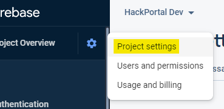
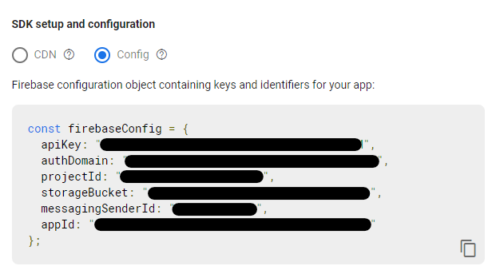
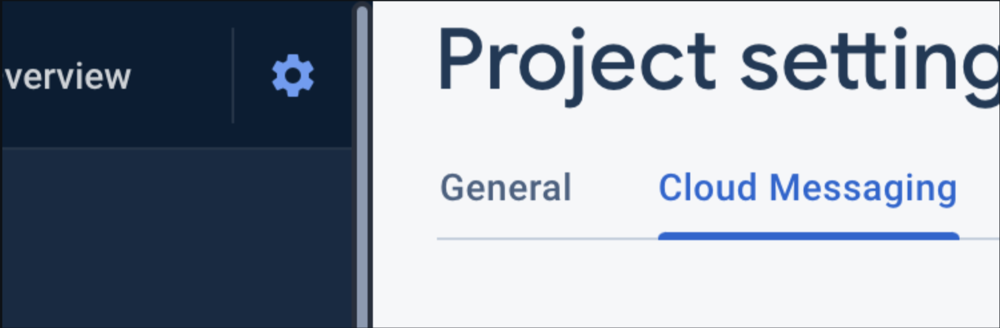
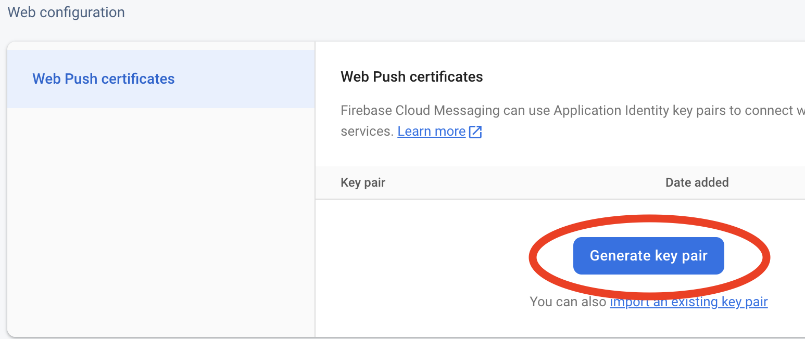
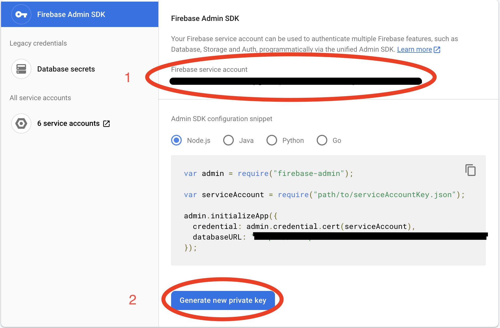
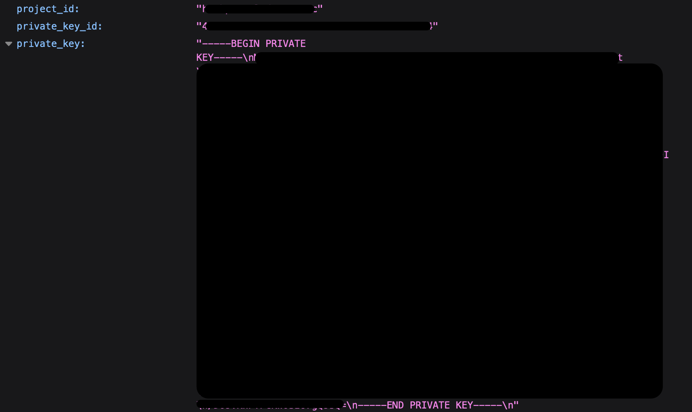
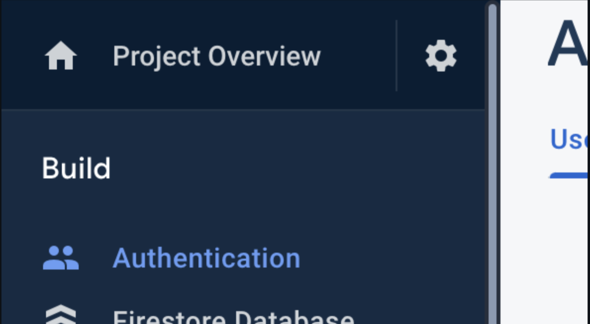
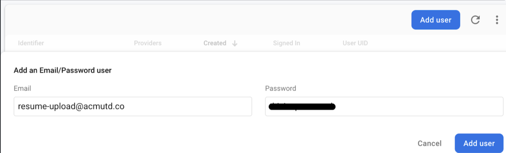

# Introduction
This tutorial will walk you through setting up the environment variables for a local deployment of HackPortal and populating fields in the database to add information to the web app. Basic knowledge of Git and web development terminology is expected. Frontend development experience and familiarity with Firebase is recommended, but not required.

# Set up

Ensure you have a working installation of [Node.js](https://nodejs.org/en/download/) and [NPM](https://docs.npmjs.com/downloading-and-installing-node-js-and-npm/).

Clone the repository and install dependencies:

```
git clone https://github.com/acmutd/hackportal
cd hackportal
npm install
```

# Important to Remember
- Start your Cloud Storage and Firestore Database in **test mode**, not **production mode** if you are setting up for development.  
- Copy all required environment variables _completely and correctly_.  
- Ensure all environment variables are in double quotes and no spaces are present, ex: 
  ```
  MEASUREMENT_ID="1234567890"
  ```


# Setting up Environment Variables

Go to the HackPortal project files in your IDE. Rename the `.env.template` file to
`.env.local`. This is where the app's environment variables will be set up.

The file should look like this:

```
NEXT_PUBLIC_FIREBASE_API_KEY=
NEXT_PUBLIC_FIREBASE_APP_ID=
NEXT_PUBLIC_FIREBASE_AUTH_DOMAIN=
NEXT_PUBLIC_FIREBASE_MESSAGING_SENDER_ID=
NEXT_PUBLIC_FIREBASE_PROJECT_ID=
NEXT_PUBLIC_FIREBASE_STORAGE_BUCKET=
NEXT_PUBLIC_RESUME_UPLOAD_PASSWORD=
NEXT_PUBLIC_RESUME_UPLOAD_SERVICE_ACCOUNT=
NEXT_PUBLIC_VAPID_KEY=
NEXT_PUBLIC_MEASUREMENT_ID=
SERVICE_ACCOUNT_CLIENT_EMAIL=
SERVICE_ACCOUNT_PRIVATE_KEY=
SERVICE_ACCOUNT_PROJECT_ID=

```

## Creating a Project and Preliminary Setup
To set up the environment, first go to the [Firebase Console](https://console.firebase.google.com).
Switch to your intended Google account before continuing.

Create a Firebase project or use an existing Firebase project.

- If creating a new project, create a new web application and take note of the
  configuration code provided. Copy that somewhere.
- If using an existing project, navigate to project settings and find the app's
  Firebase configuration.






Copy the API Key, the Auth Domain, the Project ID, the Storage Bucket, the Messaging Sender ID, and the App ID into their corresponding environment variables in `.env.local`.

To configure the cloud messaging API, go to the “Cloud Mesaging” tab. To generate the vapid key, scroll down to the "Web Configuration" and generate a key pair. Copy the key pair generated and fill in the corresponding environment variable.




## Setting up the service account environment variables.  
Navigate to "Service Accounts" under the Project Settings and copy the Firebase service account name. This is the Service Account Client Email.  
Generate a new private key and download the file. Open the file and copy the Project ID. Update the corresponding environment variable.  
In the same JSON file, copy the full private key (it should be lengthy) and paste it into the  corresponding environment variable.  




## Resume Upload Account Setup

Navigate to the authentication tab.



Under the “Users” tab, click the button that says “Add user”. Enable sign in with email/password if necessary. 

Create a user with an email and password. Copy the email into: 
```
NEXT_PUBLIC_RESUME_UPLOAD_SERVICE_ACCOUNT=
```
and the password into:
```
NEXT_PUBLIC_RESUME_UPLOAD_PASSWORD=
```



## Firebase Setup
 Follow the instructions in the [Firebase Setup doc](./firebase-setup.md) to see how to set Firebase up for your hackathon.

## Hackerpack Setup
Follow the instructions in the [Hackerpack Setup docs](./hackerpack-setup.md) to see the different ways to set up the hackerpack. This is a place where you can display your detailed event info, workshops, food, tech guides, and whatever else you want. We have made it as simple as creating a Notion page (though you can definitely write your HTML!).

# Starting the Server
Run the development server:

```
npm run dev
```

Open [http://localhost:3000](http://localhost:3000) with your browser to see
the result.

This project uses a few tools to enforce code quality:

- [Prettier](https://prettier.io), an opinionated code formatter
- [Conventional Commits](https://www.conventionalcommits.org/en/v1.0.0/), a
  format for consistent commit messages
- [Commitizen](https://github.com/commitizen/cz-cli), a tool for easily making
  formatted commits.

The repository already has these set up. Contributors only need to run
`git commit`, and Commitizen will take care of the rest with a commit flow. If you find Commitizen to be annoying, feel free to uninstall it.
